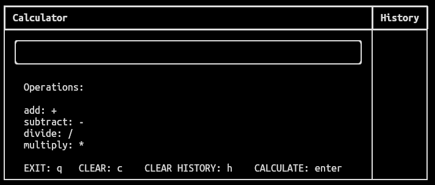
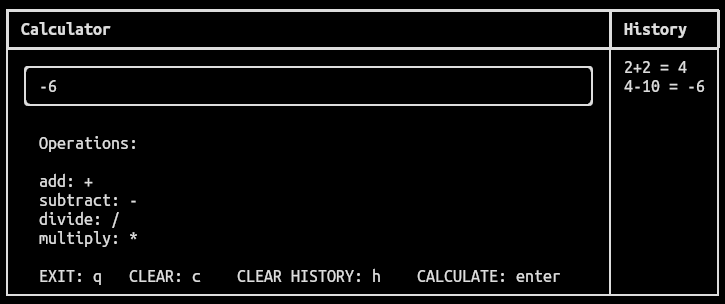

# Calculator Python

## Installation

```bash
pip install -r requirements.txt
```

## Run

```bash
python main.py or py main.py
```

## Screenshots




## Dependencies

* [rich](https://pypi.org/project/rich/): Library for rich text and beautiful formatting in the terminal.
* [readchar](https://pypi.org/project/readchar/): Library to easily read single chars and keystrokes.

## Contributors

* Andres Parra - [byandrev](https://github.com/byandrev)
* Mauricio Di Donato - [MauricioDDS](https://github.com/MauricioDDS)
* Andersson Cardenas - [anderssonccg](https://github.com/anderssonccg)